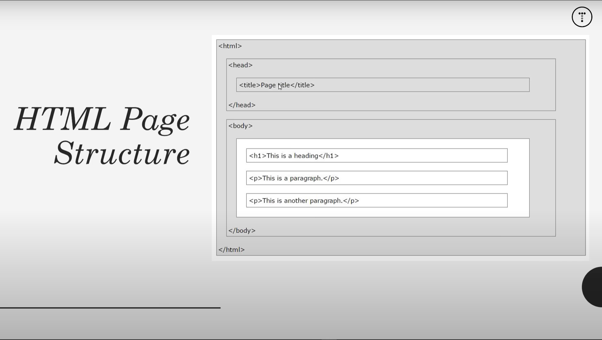

# 02. Tag Syntax

- Element names surrounded by angle brackets - `<tagname>content</tagname>`.
- Normally come in pairs (start tag and end tag) - `<h1>About Us</h1>`.
- Ending is usually the same but with a forward slash - `<p>This is paragraph</p>`.
- Some tags close themselves (Remnant of XHTML) - `<br />` (self closing), `<br> (Fine in HTML5)`.

## HTML page structure



## Page Structure (HTML)

```html
<!DOCTYPE html>
<html>
    <head>
        <title>Page Title</title>
    </head>
    <body>
        <h1>My First Heading</h1>
        <p>My first paragraph.</p>
    </body>
</html>
```

## Doctype

- Explains what type of document the page is.
- HTML4, HTML5, XHTML, etc

### HTML5

```html
<!DOCTYPE html>
```

### HTML4.01 Strict

```html
<!DOCTYPE HTML PUBLIC "-//W3C//DTD HTML4.01//EN" "https://www.w3.org/TR/html4/strict.dtd">
```

### XHTML1.0 Strict

```html
<!DOCTYPE html PUBLIC "-//W3C//DTD XHTML1.0 Strict//EN" "https://www.w3.org/TR/xhtml1/DTD/xhtml1-strict.dtd">
```


