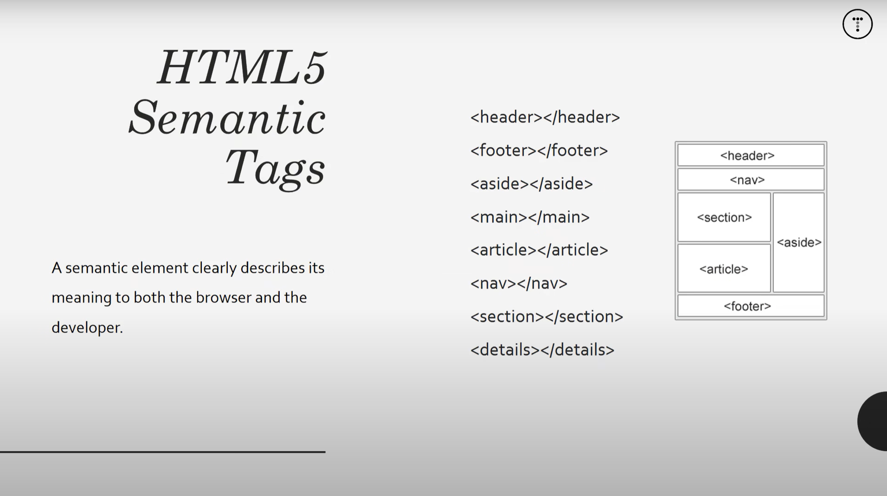

# HTML By Traversy YT Media

- [HTML By Traversy YT Media](#html-by-traversy-yt-media)
  - [00. What you need?](#00-what-you-need)
  - [01. Introduction](#01-introduction)
  - [02. Tag Syntax](#02-tag-syntax)
  - [03. Inline vs Block](#03-inline-vs-block)
  - [04. Tag Attributes](#04-tag-attributes)
  - [05. Lists](#05-lists)
  - [06. Table](#06-table)
  - [07. Forms](#07-forms)
  - [08. Button](#08-button)
  - [09. Images](#09-images)
  - [10. Quotations](#10-quotations)
  - [11. Abbreviations](#11-abbreviations)
  - [12. cite](#12-cite)
  - [13. Semantic Tags](#13-semantic-tags)
  - [14. Reference](#14-reference)


## 00. What you need?

- No Prior Knowledge.
- Start from beginning (This is for beginners).
- Little to no CSS (In this Video).
- We will focus on HTML5 only.
- Slide and examples
- Be patient:
  - You are not gonna learn HTML in just 5 or 10 minutes - absolute bullshit
  - If you're going to be a web developer you have to be patient.
- Enjoy Learning:
  - You have to really enjoy learning even you land a good job you're going to learning every single day.
  - If you're that impatient where you can't watch an hour long course then you probably wrong profession.


## 01. Introduction

Hello World

```html
Hello World
```

## 02. Tag Syntax


```html
<!DOCTYPE html>
<html>
    <head>
        <title>HTML Cheat Sheet</title>
    </head>
    <body>
        <!-- Headings -->
        <h1>Heading One</h1>
        <h2>Heading Two</h2>
        <h3>Heading Three</h3>
        <h4>Heading Four</h4>
        <h5>Heading Five</h5>
        <h6>Heading Six</h6>

        <!-- Paragraph -->
        <p>Lorem ipsum dolor sit amet consectetur adipisicing elit. Repellendus, quo! Repellendus quidem, tempora incidunt doloribus at tempore a unde alias itaque nisi quasi eaque in facilis autem impedit soluta accusantium.</p>
        <p>Lorem ipsum dolor sit amet, consectetur adipisicing elit. Culpa, quas aliquid? Veniam iste ducimus atque temporibus nihil quo mollitia tempora error animi, sit aliquam. Fugiat accusamus beatae vero accusantium provident vel explicabo soluta dolorum dolorem? Maxime ipsam iusto nihil repellendus.</p>

    </body>
</html>
```

<!-- Headings -->
<h1>Heading One</h1>
<h2>Heading Two</h2>
<h3>Heading Three</h3>
<h4>Heading Four</h4>
<h5>Heading Five</h5>
<h6>Heading Six</h6>

<!-- Paragraph -->
<p>Lorem ipsum dolor sit amet consectetur adipisicing elit. Repellendus, quo! Repellendus quidem, tempora incidunt doloribus at tempore a unde alias itaque nisi quasi eaque in facilis autem impedit soluta accusantium.</p>
<p>Lorem ipsum dolor sit amet, consectetur adipisicing elit. Culpa, quas aliquid? Veniam iste ducimus atque temporibus nihil quo mollitia tempora error animi, sit aliquam. Fugiat accusamus beatae vero accusantium provident vel explicabo soluta dolorum dolorem? Maxime ipsam iusto nihil repellendus.</p>


## 03. Inline vs Block

```html
<!-- inline elements- strong, em, a -->
<p>Lorem ipsum dolor sit amet consectetur adipisicing elit. <strong>Lorem ipsum dolor sit amet.</strong><em>Aliquam repellat</em> consequuntur omnis aliquid minus optio iure esse quos quas itaque? <a href="about.html">Dolores</a> dolore <a href="https://google.com" target="_blank">error</a>, voluptate nostrum autem ipsam assumenda minus maxime? Odit, inventore ea.</p>
```
<p>Lorem ipsum dolor sit amet consectetur adipisicing elit. <strong>Lorem ipsum dolor sit amet.</strong><em>Aliquam repellat</em> consequuntur omnis aliquid minus optio iure esse quos quas itaque? <a href="about.html">Dolores</a> dolore <a href="https://google.com" target="_blank">error</a>, voluptate nostrum autem ipsam assumenda minus maxime? Odit, inventore ea.</p>


## 04. Tag Attributes

```html
<!-- Tag Attributes -->
<h1 title="My Company">About Us</h1>
<a href="hello.com">Hello</a>
```
<a href="hello.com">Hello</a>

## 05. Lists

```html
<!-- Lists -->
<ul>
    <li>List Item 1</li>
    <li>List Item 2</li>
    <li>List Item 3</li>
    <li>List Item 4</li>
</ul>

<ol>
    <li>List Item 1</li>
    <li>List Item 2</li>
    <li>List Item 3</li>
    <li>List Item 4</li>
</ol>
```
<ul>
  <li>List Item 1</li>
  <li>List Item 2</li>
  <li>List Item 3</li>
  <li>List Item 4</li>
</ul>

<ol>
  <li>List Item 1</li>
  <li>List Item 2</li>
  <li>List Item 3</li>
  <li>List Item 4</li>
</ol>

## 06. Table

```html
<!-- Table -->
<table>
    <thead>
        <tr>
            <th>Name</th>
            <th>Email</th>
            <th>Age</th>
        </tr>
    </thead>
    <tbody>
        <tr>
            <td>John doe</td>
            <td>jdoe@gmail.com</td>
            <td>44</td>
        </tr>
        
        <tr>
            <td>Sara Williams</td>
            <td>sara@gmail.com</td>
            <td>22</td>
        </tr>
        
        <tr>
            <td>Brad Traversy</td>
            <td>brad@gmail.com</td>
            <td>32</td>
        </tr>
    </tbody>
</table>
```
<table>
  <thead>
    <tr>
      <th>Name</th>
      <th>Email</th>
      <th>Age</th>
    </tr>
  </thead>
  <tbody>
    <tr>
      <td>John doe</td>
      <td>jdoe@gmail.com</td>
      <td>44</td>
    </tr>
    <tr>
      <td>Sara Williams</td>
      <td>sara@gmail.com</td>
      <td>22</td>
    </tr>
    <tr>
      <td>Brad Traversy</td>
      <td>brad@gmail.com</td>
      <td>32</td>
    </tr>
  </tbody>
</table>

## 07. Forms

```html
<!DOCTYPE html>
<html>
    <head>
        <title>07. Forms</title>
    </head>
    <body>
        <br>
        <hr>
        <br>
        <!-- Forms -->
        <form action="process.php" method="post">
            <div>
                <label for="">First Name</label>
                <input type="text" name="firstName" placeholder="Enter Your First Name">
            </div>
            <br>
            <div>
                <label for="">Last Name</label>
                <!-- Use camelCase -->
                <input type="text" name="lastName" placeholder="Enter Your Last Name">
            </div>
            <br>
            <div>
                <label for="">Email</label>
                <input type="email" name="email">
            </div>
            <br>
            <div>
                <label for="">Message</label>
                <textarea name="message" id="" cols="30" rows="5"></textarea>
            </div>
            <br>
            <div>
                <label for="">Gender</label>
                <select name="gender" id="">
                    <option value="male">Male</option>
                    <option value="female">Female</option>
                    <option value="other">Other</option>
                </select>
            </div>
            <br>
            <div>
                <label for="">Age:</label>
                <input type="number" name="age" value="30">
            </div>
            <br>
            <div>
                <label for="">Birthday:</label>
                <input type="date" name="birthday">
            </div>
            <br>
            <div>
                <input type="submit" name="submit" value="Submit">
            </div>
        </form>
    </body>
</html>
```
<form action="process.php" method="post">
  <div>
    <label for="">First Name</label>
    <input type="text" name="firstName" placeholder="Enter Your First Name">
  </div>
  <br>
  <div>
    <label for="">Last Name</label>
    <!-- Use camelCase -->
    <input type="text" name="lastName" placeholder="Enter Your Last Name">
  </div>
  <br>
  <div>
    <label for="">Email</label>
    <input type="email" name="email">
  </div>
  <br>
  <div>
    <label for="">Message</label>
    <textarea name="message" id="" cols="30" rows="5"></textarea>
  </div>
  <br>
  <div>
    <label for="">Gender</label>
    <select name="gender" id="">
      <option value="male">Male</option>
      <option value="female">Female</option>
      <option value="other">Other</option>
    </select>
  </div>
  <br>
  <div>
    <label for="">Age:</label>
    <input type="number" name="age" value="30">
  </div>
  <br>
  <div>
    <label for="">Birthday:</label>
    <input type="date" name="birthday">
  </div>
  <br>
  <div>
    <input type="submit" name="submit" value="Submit">
  </div>
</form>

## 08. Button

```html
<!-- Button -->
<button click="someFunction">Click Me</button>
```
<button click="someFunction">Click Me</button>

## 09. Images

```html
<!-- Image -->
<a href="images/sample.jpg">
    
</a>


```
<a href="09-images/images/sample.jpg">
    
</a>


## 10. Quotations

```html
<!-- Quotations -->
<blockquote cite="https://traversymedia.com">
    Lorem ipsum dolor sit amet, consectetur adipisicing elit. Odio excepturi blanditiis, saepe harum quas amet.
</blockquote>
```
<blockquote cite="https://traversymedia.com">
    Lorem ipsum dolor sit amet, consectetur adipisicing elit. Odio excepturi blanditiis, saepe harum quas amet.
</blockquote>

## 11. Abbreviations

```html
<!-- Abbreviations -->
<p>The <abbr title="World Wide Web">WWW</abbr> is awesome.</p>
```
<p>The <abbr title="World Wide Web">WWW</abbr> is awesome.</p>
<p>-------> <strong><abbr title="Life is so hard!">Hover me</abbr></strong> <--------</p>

## 12. cite

```html
<!-- cite tag -->
<p><cite>HTML crash course</cite> by Brad Traversy</p>
```
<p><cite>HTML crash course</cite> by Brad Traversy</p>


## 13. Semantic Tags



```html
<!DOCTYPE html>
<html>

<head>
    <title>My Blog</title>
    <meta name="description" content="Awesome blog by Traveresy Media">
    <meta name="keywords" content="web design blog, web dev blog, traversy media">
    <style type="text/css">
        #main-header{
            text-align: center;
            background-color: black;
            color: white;
            padding: 10px;
        }
        #main-footer{
            text-align: center;
            font-size: 18px;
        }
    </style>
</head>

<body>
    <header id="main-header">
        <h1>My Website</h1>
    </header>

    <br>
    <a href="index.html">Go to index</a>


    <section>
        <article class="post">
            <h3>Blog Post One</h3>
            <small>Posted by Irfan on May 07</small>
            <p>Lorem ipsum dolor sit amet consectetur adipisicing elit. Dicta vero omnis quia cumque recusandae nisi
                neque magnam nostrum eveniet nulla cupiditate, provident quos asperiores veritatis illum sunt
                laudantium. Ullam error aliquid molestiae est voluptate ad magni sunt quo exercitationem officia.</p>
            <a href="post.html">Read More</a>
        </article>
        <article class="post">
            <h3>Blog Post Two</h3>
            <small>Posted by Irfan on May 07</small>
            <p>Lorem ipsum dolor sit amet consectetur adipisicing elit. Dicta vero omnis quia cumque recusandae nisi
                neque magnam nostrum eveniet nulla cupiditate, provident quos asperiores veritatis illum sunt
                laudantium. Ullam error aliquid molestiae est voluptate ad magni sunt quo exercitationem officia.</p>
            <a href="post.html">Read More</a>
        </article>
        <article class="post">
            <h3>Blog Post Three</h3>
            <small>Posted by Irfan on May 07</small>
            <p>Lorem ipsum dolor sit amet consectetur adipisicing elit. Dicta vero omnis quia cumque recusandae nisi
                neque magnam nostrum eveniet nulla cupiditate, provident quos asperiores veritatis illum sunt
                laudantium. Ullam error aliquid molestiae est voluptate ad magni sunt quo exercitationem officia.</p>
            <a href="post.html">Read More</a>
        </article>
        <article class="post">
            <h3>Blog Post Four</h3>
            <small>Posted by Irfan on May 07</small>
            <p>Lorem ipsum dolor sit amet consectetur adipisicing elit. Dicta vero omnis quia cumque recusandae nisi
                neque magnam nostrum eveniet nulla cupiditate, provident quos asperiores veritatis illum sunt
                laudantium. Ullam error aliquid molestiae est voluptate ad magni sunt quo exercitationem officia.</p>
            <a href="post.html">Read More</a>
        </article>
    </section>

    <aside>
        <h3>Categories</h3>
        <nav>
            <ul>
                <li><a href="#">Category 1</a></li>
                <li><a href="#">Category 2</a></li>
                <li><a href="#">Category 3</a></li>
            </ul>
        </nav>
    </aside>

    <footer id="main-footer">
        <p>Copyright &copy; 2023, My Website</p>
    </footer>
</body>
</html>
```
<!DOCTYPE html>
<html>

<head>
    <title>My Blog</title>
    <meta name="description" content="Awesome blog by Traveresy Media">
    <meta name="keywords" content="web design blog, web dev blog, traversy media">
    <style type="text/css">
        #main-header{
            text-align: center;
            background-color: black;
            color: white;
            padding: 10px;
        }
        #main-footer{
            text-align: center;
            font-size: 18px;
        }
    </style>
</head>

<body>
  <header id="main-header">
    <h1>My Website</h1>
  </header>
  <br>
  <a href="index.html">Go to index</a>
  <section>
    <article class="post">
      <h3>Blog Post One</h3>
      <small>Posted by Irfan on May 07</small>
      <p>Lorem ipsum dolor sit amet consectetur adipisicing elit. Dicta vero omnis quia cumque recusandae nisi neque magnam nostrum eveniet nulla cupiditate, provident quos asperiores veritatis illum sunt laudantium. Ullam error aliquid molestiae est voluptate ad magni sunt quo exercitationem officia.</p>
      <a href="post.html">Read More</a>
    </article>
    <article class="post">
      <h3>Blog Post Two</h3>
      <small>Posted by Irfan on May 07</small>
      <p>Lorem ipsum dolor sit amet consectetur adipisicing elit. Dicta vero omnis quia cumque recusandae nisi neque magnam nostrum eveniet nulla cupiditate, provident quos asperiores veritatis illum sunt laudantium. Ullam error aliquid molestiae est voluptate ad magni sunt quo exercitationem officia.</p>
      <a href="post.html">Read More</a>
    </article>
    <article class="post">
      <h3>Blog Post Three</h3>
      <small>Posted by Irfan on May 07</small>
      <p>Lorem ipsum dolor sit amet consectetur adipisicing elit. Dicta vero omnis quia cumque recusandae nisi neque magnam nostrum eveniet nulla cupiditate, provident quos asperiores veritatis illum sunt laudantium. Ullam error aliquid molestiae est voluptate ad magni sunt quo exercitationem officia.</p>
      <a href="post.html">Read More</a>
    </article>
    <article class="post">
      <h3>Blog Post Four</h3>
      <small>Posted by Irfan on May 07</small>
      <p>Lorem ipsum dolor sit amet consectetur adipisicing elit. Dicta vero omnis quia cumque recusandae nisi neque magnam nostrum eveniet nulla cupiditate, provident quos asperiores veritatis illum sunt laudantium. Ullam error aliquid molestiae est voluptate ad magni sunt quo exercitationem officia.</p>
      <a href="post.html">Read More</a>
    </article>
  </section>

  <aside>
    <h3>Categories</h3>
    <nav>
      <ul>
        <li><a href="#">Category 1</a></li>
        <li><a href="#">Category 2</a></li>
        <li><a href="#">Category 3</a></li>
      </ul>
    </nav>
  </aside>

  <footer id="main-footer">
    <p>Copyright &copy; 2023, My Website</p>
  </footer>
</body>
</html>

## 14. Reference

- [HTML Crash Course](https://youtu.be/UB1O30fR-EE) by Traversy Media
